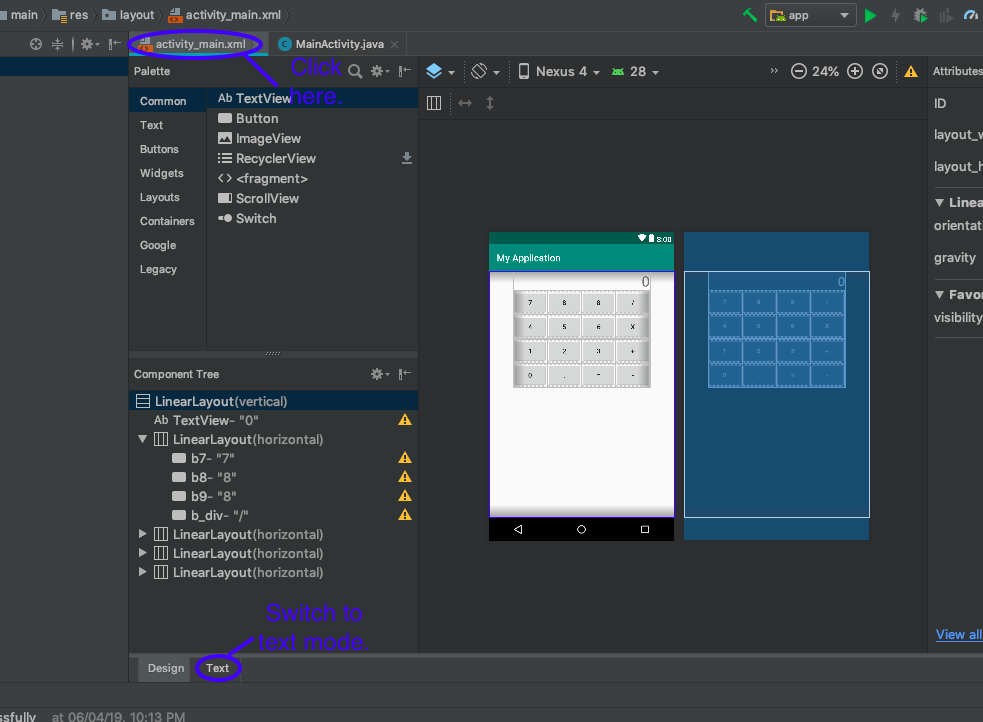

# Overview of Session 1

This tutorial will help you getting started with Java and Android Studio.

### Classes and Instances (in Java)
A class is essentially an abstract entity created by a programmer in order to deal with information more efficiently. 

An instance of an object is called an object or instance (Woah!).

For example, consider complex numbers. We need two real numbers to define a complex number. Using a class, we can define certain _properties_ and _behaviourisms_ of an entity programmatically. A complex number _z_ = (1 + 2 ***i***) is an object of class complex numbers. Another number _w_ = (3 + 4 ***i***) is another object of the same class. 

More on classes: https://www.tutorialspoint.com/java/java_object_classes.htm

(Covers _public_ and _private_ members and classes and Constructors)

### Starting with Android Studio
Install Android Studio as this using the link: https://developer.android.com/studio/
Then open Android Studio

1. Create a new project and name it Calculator. Click Next.
2. Set the minimum API Level (I like it to be Lollipop, but it's your wish). Click Next.
3. Select Empty Activity and click Finish.

Next we discussed about building the layout of the Calculator app using XML. The layout of our app is defined in `activity_main.xml`. Click on `activity_main.xml`. 

Initially, you'll be seeing the layout rendered on your screen. Switch the mode text mode and replace the code in `activity_main.xml` with this:

	<?xml version="1.0" encoding="utf-8"?>
	<LinearLayout xmlns:android="http://schemas.android.com/apk/res/android"
		xmlns:app="http://schemas.android.com/apk/res-auto"
		xmlns:tools="http://schemas.android.com/tools"
		android:layout_width="match_parent"
		android:layout_height="match_parent"
		android:orientation="vertical"
		android:paddingLeft="50dp"
		android:paddingRight="50dp"
		tools:context=".MainActivity">
		
		<TextView
			android:layout_width="match_parent"
			android:layout_height="wrap_content"
			android:text="0"
			android:textAlignment="textEnd"
			android:textSize="30sp"
			/>
		<LinearLayout
			android:layout_width="match_parent"
			android:orientation="horizontal"
			android:layout_height="wrap_content">
			<Button
				android:id="@+id/b7"
				android:layout_width="0dp"
				android:layout_height="50dp"
				android:layout_weight="1"
				android:text="7" />
			<Button
				android:id="@+id/b8"
				android:layout_width="0dp"
				android:layout_height="50dp"
				android:layout_weight="1"
				android:text="8" />
			<Button
				android:id="@+id/b9"
				android:layout_width="0dp"
				android:layout_height="50dp"
				android:layout_weight="1"
				android:text="8" />
			<Button
				android:id="@+id/b_div"
				android:layout_width="0dp"
				android:layout_height="50dp"
				android:layout_weight="1"
				android:text="/" />
		</LinearLayout>
		<LinearLayout
			android:layout_width="match_parent"
			android:orientation="horizontal"
			android:layout_height="wrap_content">
			<Button
				android:id="@+id/b4"
				android:layout_width="0dp"
				android:layout_height="50dp"
				android:layout_weight="1"
				android:text="4" />
			<Button
				android:id="@+id/b5"
				android:layout_width="0dp"
				android:layout_height="50dp"
				android:layout_weight="1"
				android:text="5" />
			<Button
				android:id="@+id/b6"
				android:layout_width="0dp"
				android:layout_height="50dp"
				android:layout_weight="1"
				android:text="6" />
			<Button
				android:id="@+id/b_mul"
				android:layout_width="0dp"
				android:layout_height="50dp"
				android:layout_weight="1"
				android:text="X" />
		</LinearLayout>
		<LinearLayout
			android:layout_width="match_parent"
			android:orientation="horizontal"
			android:layout_height="wrap_content">
			<Button
				android:id="@+id/b1"
				android:layout_width="0dp"
				android:layout_height="50dp"
				android:layout_weight="1"
				android:text="1" />
			<Button
				android:id="@+id/b2"
				android:layout_width="0dp"
				android:layout_height="50dp"
				android:layout_weight="1"
				android:text="2" />
			<Button
				android:id="@+id/b3"
				android:layout_width="0dp"
				android:layout_height="50dp"
				android:layout_weight="1"
				android:text="3" />
			<Button
				android:id="@+id/b_add"
				android:layout_width="0dp"
				android:layout_height="50dp"
				android:layout_weight="1"
				android:text="+" />
		</LinearLayout>
		<LinearLayout
			android:layout_width="match_parent"
			android:orientation="horizontal"
			android:layout_height="wrap_content">
			<Button
				android:id="@+id/b0"
				android:layout_width="0dp"
				android:layout_height="50dp"
				android:layout_weight="1"
				android:text="0" />
			<Button
				android:id="@+id/point"
				android:layout_width="0dp"
				android:layout_height="50dp"
				android:layout_weight="1"
				android:text="." />
			<Button
				android:id="@+id/b_equal"
				android:layout_width="0dp"
				android:layout_height="50dp"
				android:layout_weight="1"
				android:text="=" />
			<Button
				android:id="@+id/b_subtract"
				android:layout_width="0dp"
				android:layout_height="50dp"
				android:layout_weight="1"
				android:text="-" />
		</LinearLayout>
	</LinearLayout>
		
After doing so, switch back to Design mode to see rendered output!

Since we discussed somewhat informally in the session about nitty-gritty details about the layout, it is not easy to put it here. Try to make sense of the XML code. Most of the attributes are self-explanatory. 

In case of queries regarding the session, we can talk about it before 10:30 am, Sunday, 7th April.
